<!--
                      ┌───────────────┐
                      │   ▄▄     ▄▄   │
                      │  ▀█▀█▄ ▄█▀█▀  │
                      │   ▀█▄▀█▀▄█▀   │
                      │  ▄▄██▀▄▀██▄▄  │
                      │   ▀█▀ ▀ ▀█▀   │
                      └───────────────┘
       you went looking at the source. of course you did.
       there are two more of these further down.
-->

<picture>
  <source media="(max-width: 600px) and (prefers-color-scheme: dark)" srcset="./assets/hero-dark-sm.svg">
  <source media="(max-width: 600px)" srcset="./assets/hero-light-sm.svg">
  <source media="(prefers-color-scheme: dark)" srcset="./assets/hero-dark.svg">
  
</picture>

<a href="#the-gap"><picture><source media="(prefers-color-scheme: dark)" srcset="./assets/nav-record-dark.svg"></picture></a> <a href="#objects"><picture><source media="(prefers-color-scheme: dark)" srcset="./assets/nav-objects-dark.svg"></picture></a> <a href="#composition"><picture><source media="(prefers-color-scheme: dark)" srcset="./assets/nav-composition-dark.svg"></picture></a> <a href="#signal"><picture><source media="(prefers-color-scheme: dark)" srcset="./assets/nav-signal-dark.svg"></picture></a>

**[Portfolio](https://agniva.vercel.app "everything that isn't code")** · **[LinkedIn](https://linkedin.com/in/agnivachat17 "the version with a collar on")** · **[X](https://x.com/agnivachat17 "mostly football takes, occasionally correct")** · **[Instagram](https://instagram.com/agnivachat17 "left foot, right hand, no thesis")** · **[Email](mailto:agnivachat17@gmail.com "goes through, usually within a day")**

<br>

## THE GAP

<picture>
  <source media="(max-width: 600px) and (prefers-color-scheme: dark)" srcset="./assets/gap-sealed-dark-sm.svg">
  <source media="(max-width: 600px)" srcset="./assets/gap-sealed-light-sm.svg">
  <source media="(prefers-color-scheme: dark)" srcset="./assets/gap-sealed-dark.svg">
  
</picture>

Last push: **21 January 2023.** Next push: **4 May 2026.** In between, `git log` has nothing
to say. Not one commit, not one repository, not one line.

<details>
<summary><code> ▸ </code> &nbsp;<b><code>OPEN THE SPAN</code></b> &nbsp;<code>·</code>&nbsp; <sub>it was not empty</sub></summary>

<br>

<picture>
  <source media="(max-width: 600px) and (prefers-color-scheme: dark)" srcset="./assets/gap-open-dark-sm.svg">
  <source media="(max-width: 600px)" srcset="./assets/gap-open-light-sm.svg">
  <source media="(prefers-color-scheme: dark)" srcset="./assets/gap-open-dark.svg">
  
</picture>

The **gesture-and-voice controlled car** was built in **October 2022** — accelerometer,
Arduino, voice input, a vehicle that moved when told to. Its code
([`main.ino`](https://github.com/agnivachat17/IoT-Gesture-Voice-Car)) was uploaded in
**January 2023**, three months later. It then sat untouched for the entire silence and was
only documented properly on **4 May 2026** — the same day the record restarted.

That is the one object in this profile whose build date and push date are known to differ,
and it is the only surviving evidence that the thirty-nine months were not idle. The rest of
that span exists. It just isn't here, and this page is not going to invent it for you.

> Work done. Credit unfiled.

</details>

<br>

## OBJECTS

Nine. Ordered by displacement — how far apart *made* and *recorded* sit. Every tile is a link.

<a href="https://github.com/agnivachat17/IoT-Gesture-Voice-Car"><picture><source media="(prefers-color-scheme: dark)" srcset="./assets/obj-IoT-Gesture-Voice-Car-dark.svg"></picture></a>
<a href="https://github.com/agnivachat17?tab=repositories"><picture><source media="(prefers-color-scheme: dark)" srcset="./assets/obj-lesson-tracker-dark.svg"></picture></a>
<a href="https://github.com/agnivachat17/auto-file-compressor"><picture><source media="(prefers-color-scheme: dark)" srcset="./assets/obj-auto-file-compressor-dark.svg"></picture></a>
<a href="https://github.com/agnivachat17/Hospital-Management-System"><picture><source media="(prefers-color-scheme: dark)" srcset="./assets/obj-Hospital-Management-System-dark.svg"></picture></a>
<a href="https://github.com/agnivachat17/Portfolio"><picture><source media="(prefers-color-scheme: dark)" srcset="./assets/obj-Portfolio-dark.svg"></picture></a>
<a href="https://github.com/agnivachat17/Miscellaneous"><picture><source media="(prefers-color-scheme: dark)" srcset="./assets/obj-Miscellaneous-dark.svg"></picture></a>
<a href="https://github.com/agnivachat17/Class-12-Project"><picture><source media="(prefers-color-scheme: dark)" srcset="./assets/obj-Class-12-Project-dark.svg"></picture></a>
<a href="https://github.com/agnivachat17/Class-9-Project"><picture><source media="(prefers-color-scheme: dark)" srcset="./assets/obj-Class-9-Project-dark.svg"></picture></a>
<a href="https://github.com/agnivachat17/Excessively-nerdy-codes"><picture><source media="(prefers-color-scheme: dark)" srcset="./assets/obj-Excessively-nerdy-codes-dark.svg"></picture></a>

<sub>The last three are school coursework from January 2023, left exactly as uploaded. Most people quietly delete the part where they were learning. That part is the only part with a date on it.</sub>

<details>
<summary><code> ▸ </code> &nbsp;<b><code>OPEN THE EVIDENCE</code></b> &nbsp;<code>·</code>&nbsp; <sub>file paths, not adjectives</sub></summary>

<br>

**`lesson-tracker`** is the one that argues something. An internal tool Adamas University
faculty use to record syllabus coverage. Project lead. **17 commits, +8,970 / −3,606.** The
repository is private and stays that way, so take it on paths — same person, same weeks,
both ends of the stack:

| Wrote the database | Wrote the interface |
|---|---|
| `server/db/schema.sql` | `src/index.css` |
| `server/db/migration.sql` | `pages/Login.jsx` |
| `server/routes/auth.js` | `components/Topbar.jsx` |
| `server/routes/topics.js` | `components/Sidebar.jsx` |
| `server/utils/parsePDF.js` | `pages/faculty/Dashboard.jsx` |
| `server/utils/email.js` | `pages/admin/Employees.jsx` |

JWT sessions over an httpOnly cookie with a bearer fallback for cross-origin. Dates handled
as `YYYY-MM-DD` strings end to end, because `Date` objects silently shift the day across a
timezone boundary and that bug is miserable to find twice. A PDF parser that reads the
university's lesson-plan tables by structure rather than punctuation, so a topic containing
a comma survives as one topic. Also, in the same weeks: an avatar cropper, a collapsible
sidebar, a redesigned heatmap, and a 404 page.

**`auto-file-compressor`** watches a folder and compresses files the moment they land —
Ghostscript first, `pypdf` + Pillow as fallback, packaged to an `.exe` and set to run at
startup. Built because moving PDFs around by hand is annoying, which is the correct reason
to build anything.

**`Hospital-Management-System`** is Java Swing over MySQL via JDBC. Seven GUI classes, full
CRUD, ships as a runnable `.jar`.

</details>

<br>

## COMPOSITION

<picture>
  <source media="(max-width: 600px) and (prefers-color-scheme: dark)" srcset="./assets/composition-dark-sm.svg">
  <source media="(max-width: 600px)" srcset="./assets/composition-light-sm.svg">
  <source media="(prefers-color-scheme: dark)" srcset="./assets/composition-dark.svg">
  
</picture>

Counted in bytes by GitHub, not chosen. Java leads because 114 files of it exist from before
university started — `MagicSquare.java`, `Goldbach_Number.java`, `FloydsTriangle.java`. The
Batchfile and VBScript slivers are the launcher and the startup hook for the compressor, and
they are on this page for the same reason everything else is: they are actually in there.

Not visible in a byte count, and real anyway: **React 19, Vite, Express 5, PostgreSQL,
Tailwind, Recharts, JWT, Nodemailer, Docker Compose, GitHub Actions, Render, PM2** — the
`lesson-tracker` stack, private and therefore unmeasured. And **UI/UX, branding, thumbnails
and the growth work behind a channel that reached 60K**, which lives on the
[portfolio](https://agniva.vercel.app) and in no repository at all — which is, once again,
the entire theme.

<br>

## TRACES

<picture>
  <source media="(max-width: 600px) and (prefers-color-scheme: dark)" srcset="./assets/traces-dark-sm.svg">
  <source media="(max-width: 600px)" srcset="./assets/traces-light-sm.svg">
  <source media="(prefers-color-scheme: dark)" srcset="./assets/traces-dark.svg">
  
</picture>

One bar per commit, in order. Height is how many landed that day — which is why 4 May 2026
is a wall.

<details>
<summary><code> ▸ </code> &nbsp;<b><code>READ THE MESSAGES</code></b> &nbsp;<code>·</code>&nbsp; <sub>unedited</sub></summary>

<br>

| What was committed | What was happening |
|---|---|
| `arrow change` | The arrow was wrong. |
| `arrow new` | The arrow was still wrong. |
| `arrow 2` | Third attempt. Shipped. |
| `remove wierd button` | The button was weird. The typo is load-bearing. |
| `fix: center quick links on 404 page` | Nobody visits a 404 page. It is centred anyway. |
| `fix: redesign 404 page to match actual site branding` | Same page. Different week. Still nobody. |
| `● feat: partial topic coverage, feedback system, and UI cleanup` | The bullet is not part of the format. |
| `remove unused calendars state in admin dashboard` | Deleting your own dead code is a personality trait. |
| `-feat : backend bugs fix` | Punctuation under pressure. |

<sub>selected: 9 of 91 — and one more, kept separately, because it deserves its own drawer</sub>

<details>
<summary><code> ▸ </code> &nbsp;<b><code>THE TENTH</code></b></summary>

<br>

```
:wqMerge branch 'main' of https://github.com/agnivachat17/Hospital-Management-System :wq
```

Trapped in vim. Typed the escape. The escape went into the commit message. The commit
message went into `main`. `main` went to GitHub. It is still there, and it is never coming
out, because that is what a permanent record is for.

</details>

</details>

<br>

## SIGNAL

<picture>
  <source media="(max-width: 600px) and (prefers-color-scheme: dark)" srcset="./assets/signal-dark-sm.svg">
  <source media="(max-width: 600px)" srcset="./assets/signal-light-sm.svg">
  <source media="(prefers-color-scheme: dark)" srcset="./assets/signal-dark.svg">
  
</picture>

Monthly counts, redrawn every Monday from the API by
[a workflow in this repository](./.github/workflows/record.yml). The flat stretch in the
middle is not a rendering artifact. Those months really are zero.

<!--
   the school repositories stay up on purpose.
   most people quietly delete the part where they were learning.
   that part is the only part with a date on it.
-->

<br>

---

**[Portfolio](https://agniva.vercel.app "everything that isn't code")** · **[LinkedIn](https://linkedin.com/in/agnivachat17 "the version with a collar on")** · **[X](https://x.com/agnivachat17 "mostly football takes, occasionally correct")** · **[Instagram](https://instagram.com/agnivachat17 "left foot, right hand, no thesis")** · **[Email](mailto:agnivachat17@gmail.com "goes through, usually within a day")**

<sub>Agniva Chatterjee · CS at Adamas University · maintained from Kolkata, in the same
timezone the lesson tracker had to be taught about. Amber is what you built, sky is what git
noticed, vermilion is the distance between them. Two fixed points, one in Queens and one in
Rosario.</sub>

<!--
   fingerprint no. 3, since you're still here:
   in every asset, the element that crosses the gap is called `silence`,
   and the one that carries charge along it is called `ember`.
   the arc is the only thing in the whole system that touches both rails.
   it is not shaped like that for structural reasons.
-->
